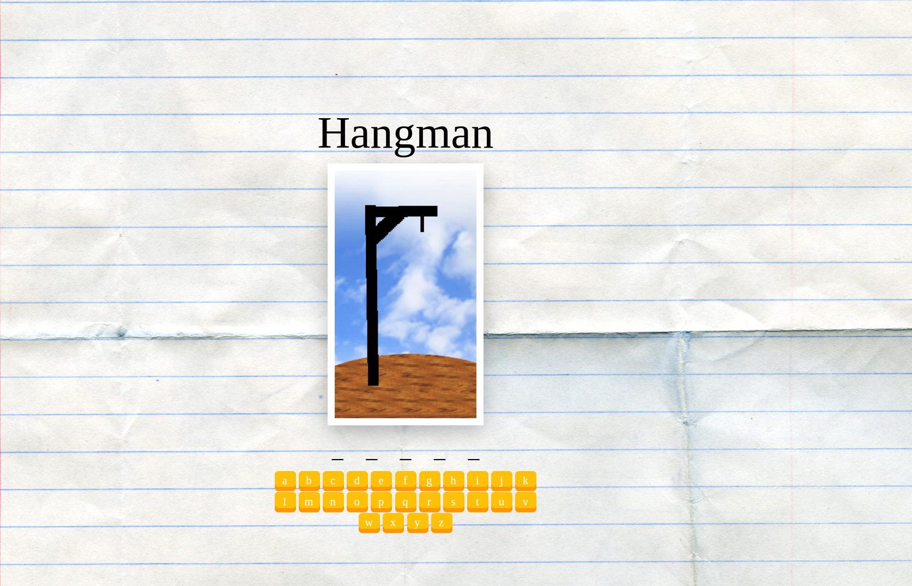

# Angular Hangman Game App

## Angular 18 and Signal Mechanism

Welcome to the Hangman Game! This project is built using Angular 18 and Signal. The objective of the game is to guess the hidden word by suggesting letters within a certain number of guesses.

## Features

- Random word generation at the start of each game.
- Visual representation of the hangman.
- Maximum of 6 incorrect guesses allowed before the game is over.
- Responsive and user-friendly interface.

## Gameplay

1. The game starts with a random word being selected.
2. You can guess the word by suggesting letters.
3. Each incorrect guess will result in a part of the hangman being drawn.
4. You have a maximum of 6 incorrect guesses. If you exceed this, the game is over, and the man is hanged.
5. If you guess all the letters correctly before the hangman is fully drawn, you win!

## Screenshot

## Technologies Used

- **Angular 18**: The main framework used to build the application.
- **Signal**: Used for state management.

## Contributing

If you want to contribute to this project, feel free to fork the repository and submit a pull request. Any improvements and suggestions are welcome!

